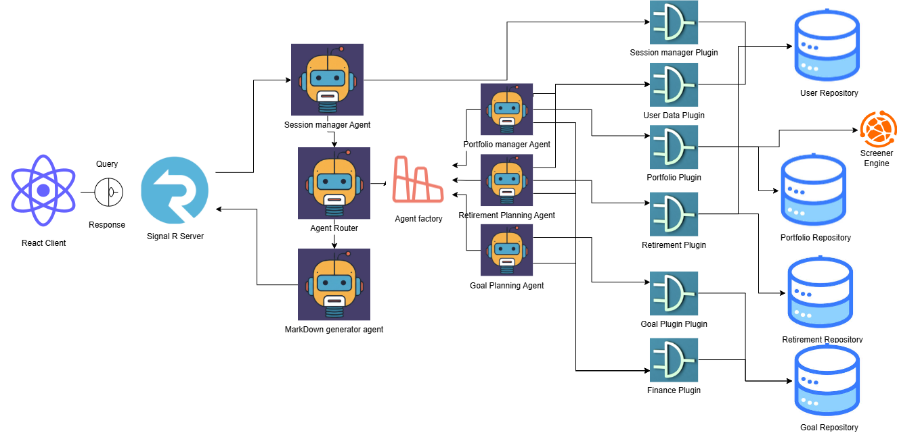

# Chat Application

## Architecture Diagram



---

## DEMO

[![Watch the Demo]](https://youtu.be/nrkfGGU1mfg?feature=shared)

---

## SETUP

This project consists of two parts:
- **Chat_frontend**: A React.js project.
- **ChatbotBackend**: A .NET Web Application that uses SignalR for real-time communication and Entity Framework Core for database operations.

---

## Chat_frontend (React)

### Setup & Run

1. Navigate to the `Chat_frontend` directory:

    ```bash
    cd chat_frontend
    ```

2. Install dependencies:

    ```bash
    npm install
    ```

3. Start the development server:

    ```bash
    npm start
    ```

The React app will typically run on [http://localhost:3000](http://localhost:3000).

---

## ChatbotBackend (.NET Web Application)

### Technologies Used

- ASP.NET Core Web API
- SignalR (real-time communication)
- Entity Framework Core (database access)

### Setup & Run

1. Navigate to the `ChatbotBackend` directory:

    ```bash
    cd ChatbotBackend
    ```

2. Restore the project dependencies:

    ```bash
    dotnet restore
    ```

3. Update your `appsettings.json` as described below.

4. Apply Entity Framework Core migrations and update the database:

    ```bash
    dotnet ef database update
    ```

5. Run the application:

    ```bash
    dotnet run
    ```

The backend server will typically run on:
- [http://localhost:5053/chat]((http://localhost:5053/chat)) (HTTP)

---

### Configuration (`appsettings.json`)

Before running the backend, create or update your `appsettings.json` file as follows:

```json
{
  "Logging": {
    "LogLevel": {
      "Default": "Information",
      "Microsoft.AspNetCore": "Warning"
    }
  },

  "AzureOpenAI": {
    "Endpoint": "enter endpoint for azure openai deployment",
    "ApiKey": "API key",
    "DeploymentName": "gpt-4o-mini"
  },
  
  "AllowedHosts": "*"
}
