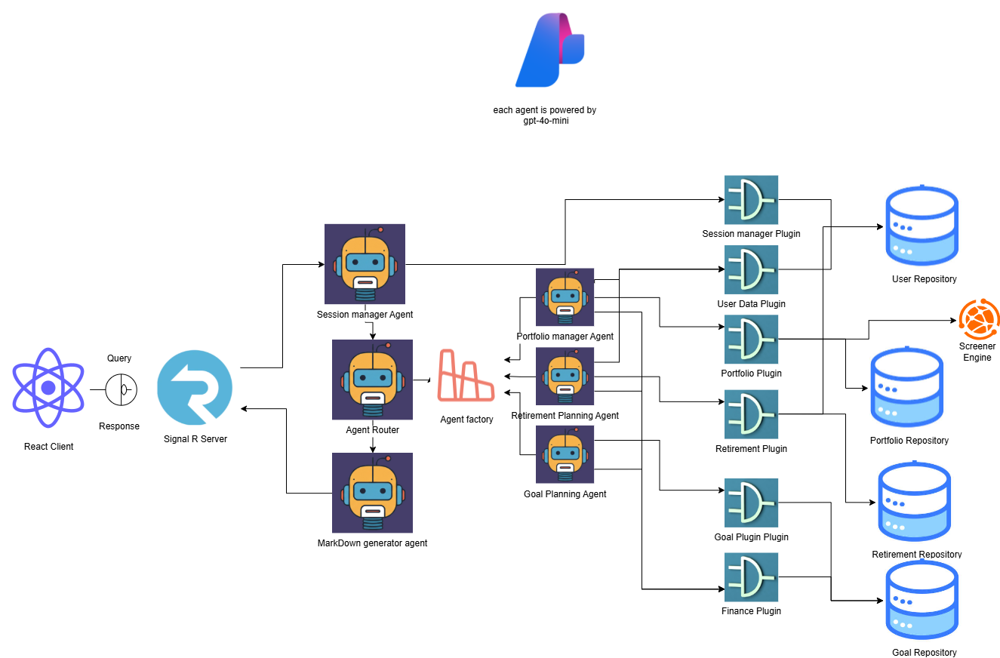

# Chat Application


## Architecture Diagram



---
This project consists of two parts:
- **Chat_frontend**: A React.js project.
- **ChatbotBackend**: A .NET Web Application that uses SignalR for real-time communication.

---

## Chat_frontend (React)

### Setup & Run

1. Navigate to the `Chat_frontend` directory:

    ```bash
    cd Chat_frontend
    ```

2. Install dependencies:

    ```bash
    npm install
    ```

3. Start the development server:

    ```bash
    npm start
    ```

The React app will typically run on [http://localhost:3000](http://localhost:3000).

---

## ChatbotBackend (.NET Web Application)

### Setup & Run

1. Navigate to the `ChatbotBackend` directory:

    ```bash
    cd ChatbotBackend
    ```

2. Restore the project dependencies:

    ```bash
    dotnet restore
    ```

3. Run the application:

    ```bash
    dotnet run
    ```

The backend server will typically run on [http://localhost:5000](http://localhost:5000) or [https://localhost:5001](https://localhost:5001).

---


## Notes

- Ensure both frontend and backend are running for full functionality.
- The frontend connects to the backend via SignalR for real-time messaging.

---
